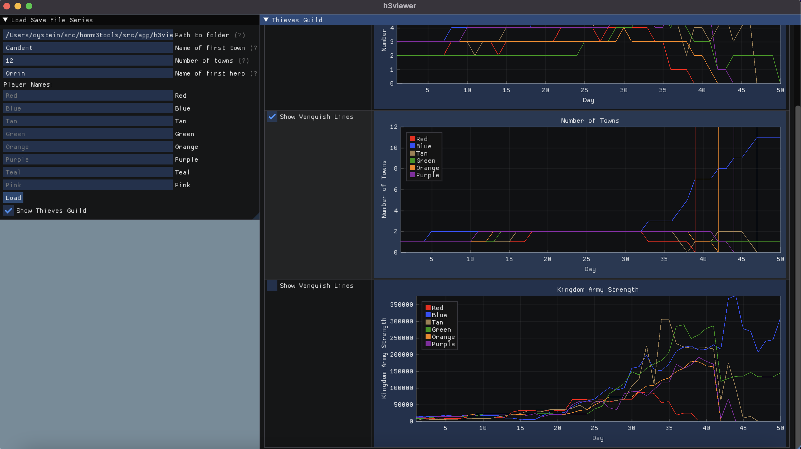
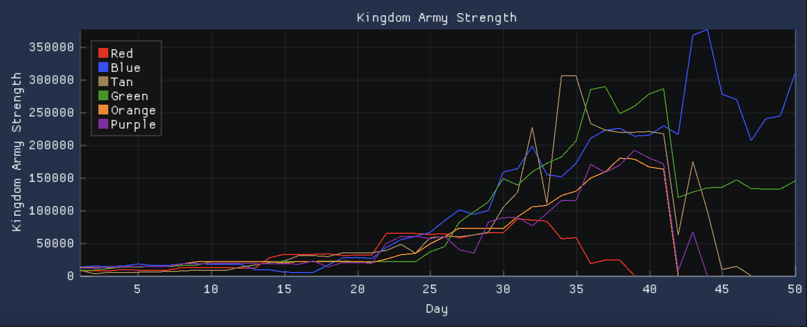
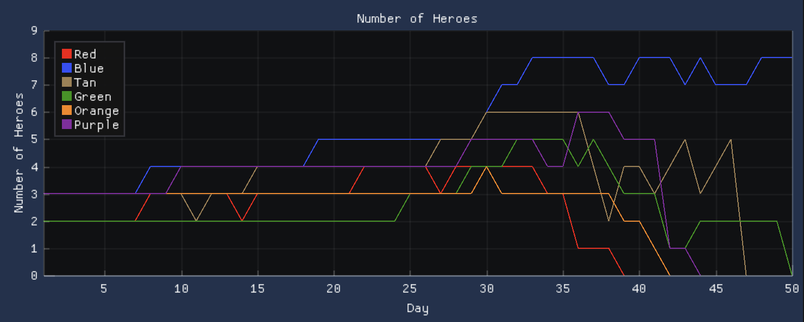
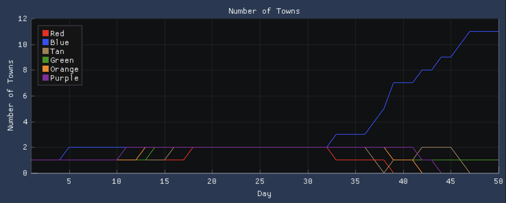

## homm3tools

homm3tools is a repository containing various tools for Heroes of Might and Magic 3, <a href="https://www.hota.acidcave.net/download.html">Horn of the Abyss</a>.
The code is currently tested working on HotA version 1.6.1.

## Base Code

The base code used to read savefiles and order the data in structs and classes is found in [src/h3](https://github.com/oysteinmyrmo/homm3tools/tree/master/src/h3).
The code in these files are used to build the other tools.

## h3viewer

[h3viewer](https://github.com/oysteinmyrmo/homm3tools/tree/master/src/app/h3viewer) is an application to visualize a series of save files (a game).

| Plot Kingdom Army Strength | Plot Number of Heroes | Plot Number of Towns |
| -------------------------- | --------------------- | -------------------- |
||||

## h3decompress

[h3decompress](https://github.com/oysteinmyrmo/homm3tools/tree/master/src/app/h3decompress) is an application to decompress a single save file.
The `h3decompress` utility is mainly a `gunzip` of the target save file. However, it does handle some quirks of the save files themselves:

- `gunzip` requires the file extension to be known while `h3decompress` does not.
- Using `gunzip` on the (renamed) save file produces the error `gzip: savefile.gz: invalid compressed data--crc error` while `h3decompress` does not.
- The reason for the former error is not known, but the checksum of the compressed library is incorrect. `h3decompress` therefore inflates/decompresses as many bytes as it can before `zlib` returns an error about incorrect data (`Z_DATA_ERROR`). It is always the last 4 bytes that are disregarded in the save files.

The first argument to `h3decompress` must be a HotA save file while the second argument must be the output filename.
